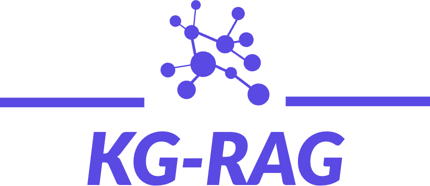
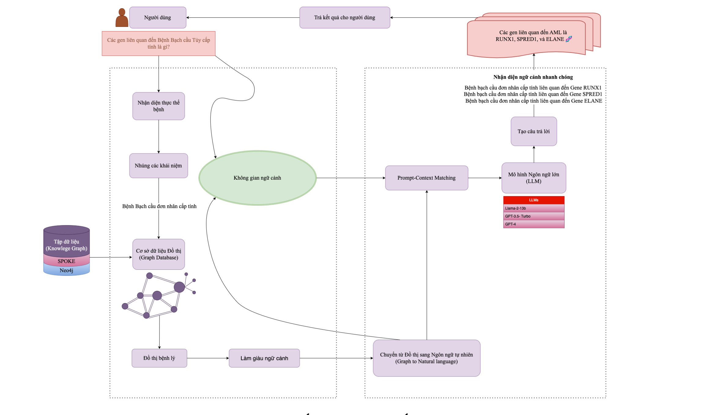
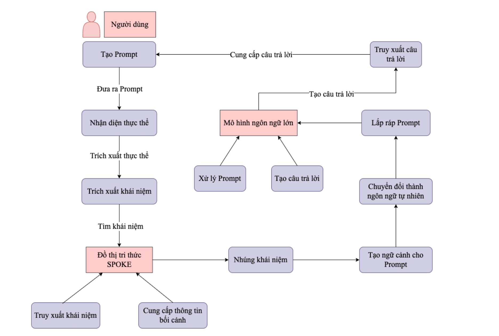
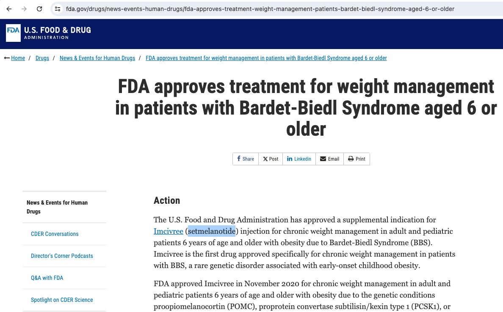

<p align="center">
  
</p>

## KG-RAG là gì?

KG-RAG là viết tắt của **Knowledge Graph-based Retrieval Augmented Generation** (Tạo lập tăng cường dựa trên Đồ thị Tri thức).

### Bắt đầu bằng cách xem kiến trúc hệ thống KG-RAG

<p align="center">
  
</p>

Đây là một framework không phụ thuộc vào nhiệm vụ, kết hợp tri thức rõ ràng từ Đồ thị Tri thức (KG) với tri thức ngầm từ Mô hình Ngôn ngữ Lớn (LLM).

### Luồng hoạt động chính kiến trúc hệ thống KG-RAG

<p align="center">
  
</p>

Ở đây, tôi sử dụng một Đồ thị Tri thức y sinh khổng lồ có tên là [SPOKE](https://spoke.ucsf.edu/) để cung cấp ngữ cảnh y sinh. SPOKE đã tích hợp hơn 40 kho lưu trữ tri thức y sinh từ các lĩnh vực khác nhau, tập trung vào các khái niệm y sinh như gen, protein, thuốc, hợp chất, bệnh tật và các kết nối đã được thiết lập. SPOKE bao gồm hơn 27 triệu nút thuộc 21 loại khác nhau và 53 triệu cạnh thuộc 55 loại [[Tham khảo](https://doi.org/10.1093/bioinformatics/btad080)].

Đặc điểm chính của KG-RAG là nó trích xuất "ngữ cảnh nhận biết gợi ý" từ SPOKE KG, được định nghĩa là:

**ngữ cảnh tối thiểu đủ để phản hồi gợi ý của người dùng.**

Do đó, framework này trao quyền cho một LLM đa năng bằng cách kết hợp một "ngữ cảnh nhận biết gợi ý" tối ưu hóa từ một KG y sinh.

## Ví dụ về cách sử dụng KG-RAG
Đoạn mã sau đây hiển thị tin tức từ trang web của FDA [website](https://www.fda.gov/drugs/news-events-human-drugs/fda-approves-treatment-weight-management-patients-bardet-biedl-syndrome-aged-6-or-older) về loại thuốc **"setmelanotide"** được FDA phê duyệt để quản lý cân nặng ở bệnh nhân mắc *Hội chứng Bardet-Biedl*.



### Hỏi GPT-4 về loại thuốc trên:

### KHÔNG SỬ DỤNG KG-RAG

*Lưu ý: Chạy trên AWS p3.8xlarge EC2 instance và sử dụng KG-RAG v0.3.0. Tham số nhiệt độ được đặt thành 0 cho tất cả các phân tích. Tham khảo tệp [yaml này](https://github.com/PineappleCuteCute/KG_RAG/blob/main/config.yaml) để thiết lập tham số.*

<video src="https://github.com/BaranziniLab/KG_RAG/assets/42702311/dbabb812-2a8a-48b6-9785-55b983cb61a4" controls="controls" style="max-width: 730px;">
</video>

### SỬ DỤNG KG-RAG

*Lưu ý: Chạy trên AWS p3.8xlarge EC2 instance và sử dụng KG-RAG v0.3.0. Tham số nhiệt độ được đặt thành 0 cho tất cả các phân tích. Tham khảo tệp [yaml này](https://github.com/PineappleCuteCute/KG_RAG/blob/main/config.yaml) để thiết lập tham số.*

<video src="https://github.com/BaranziniLab/KG_RAG/assets/42702311/acd08954-a496-4a61-a3b1-8fc4e647b2aa" controls="controls" style="max-width: 730px;">
</video>

Bạn có thể thấy rằng, KG-RAG đã cung cấp thông tin chính xác về loại thuốc được FDA phê duyệt [tại đây](https://www.fda.gov/drugs/news-events-human-drugs/fda-approves-treatment-weight-management-patients-bardet-biedl-syndrome-aged-6-or-older).

## Cách chạy KG-RAG

**Lưu ý: Hiện tại, KG-RAG được thiết kế đặc biệt để chạy các gợi ý liên quan đến Bệnh tật. Chúng tôi đang tích cực cải thiện tính linh hoạt của nó.**

### Bước 1: Clone repository

Clone repository này. Tất cả dữ liệu Y sinh được sử dụng trong bài báo đều được tải lên repository này, vì vậy bạn không cần tải xuống riêng.

### Bước 2: Tạo môi trường ảo
Lưu ý: Các script trong repository này được chạy bằng python 3.10.9
```
conda create -n kg_rag python=3.10.9
conda activate kg_rag
cd KG_RAG
```

### Bước 3: Cài đặt các phụ thuộc

```
pip install -r requirements.txt
```

### Bước 4: Cập nhật config.yaml 

[config.yaml](https://github.com/BaranziniLab/KG_RAG/blob/main/config.yaml) chứa tất cả thông tin cần thiết để chạy các script trên máy của bạn. Hãy đảm bảo điền đầy đủ thông tin vào tệp [yaml này](https://github.com/BaranziniLab/KG_RAG/blob/main/config.yaml).

Lưu ý: Có một tệp yaml khác có tên [system_prompts.yaml](https://github.com/BaranziniLab/KG_RAG/blob/main/system_prompts.yaml). Tệp này đã được điền sẵn và chứa tất cả các gợi ý hệ thống được sử dụng trong framework KG-RAG.

### Bước 5: Chạy script setup
Lưu ý: Đảm bảo bạn đang ở trong thư mục KG_RAG

Script setup chạy ở chế độ tương tác.

Chạy script setup sẽ:

- tạo cơ sở dữ liệu vector bệnh tật cho KG-RAG
- tải xuống mô hình Llama trên máy của bạn (tùy chọn, bạn có thể bỏ qua bước này nếu muốn)

```
python -m kg_rag.run_setup
```

### Bước 6: Chạy KG-RAG từ terminal
Lưu ý: Đảm bảo bạn đang ở trong thư mục KG_RAG

Bạn có thể chạy KG-RAG bằng GPT hoặc mô hình Llama.

#### Sử dụng GPT

```
# GPT_API_TYPE='azure'
python -m kg_rag.rag_based_generation.GPT.text_generation -g <mô hình GPT yêu thích của bạn - "gpt-4" hoặc "gpt-35-turbo">
# GPT_API_TYPE='openai'
python -m kg_rag.rag_based_generation.GPT.text_generation -g <mô hình GPT yêu thích của bạn - "gpt-4" hoặc "gpt-3.5-turbo">
```

Chạy trên AWS p3.8xlarge EC2 instance và sử dụng KG-RAG v0.3.0.

<video src="https://github.com/BaranziniLab/KG_RAG/assets/42702311/defcbff7-e777-4db6-b028-10f54c76b234" controls="controls" style="max-width: 730px;">
</video>

#### Sử dụng chế độ tương tác với GPT

Cho phép người dùng đi qua từng bước của quá trình một cách tương tác.

```
# GPT_API_TYPE='azure'
python -m kg_rag.rag_based_generation.GPT.text_generation -i True -g <mô hình GPT yêu thích của bạn - "gpt-4" hoặc "gpt-35-turbo">
# GPT_API_TYPE='openai'
python -m kg_rag.rag_based_generation.GPT.text_generation -i True -g <mô hình GPT yêu thích của bạn - "gpt-4" hoặc "gpt-3.5-turbo">
```

#### Sử dụng Llama
Lưu ý: Nếu bạn chưa tải xuống Llama trong bước setup, thì khi bạn chạy lệnh sau, có thể mất một chút thời gian vì nó sẽ tải xuống mô hình trước.

```
python -m kg_rag.rag_based_generation.Llama.text_generation -m <phương pháp-1 hoặc phương pháp-2, nếu không đề cập gì thì mặc định là 'phương pháp-1'>
```

Chạy trên AWS p3.8xlarge EC2 instance và sử dụng KG-RAG v0.3.0.

<video src="https://github.com/BaranziniLab/KG_RAG/assets/42702311/94bda923-dafb-451a-943a-1d7c65f3ffd4" controls="controls" style="max-width: 730px;">
</video>

#### Sử dụng chế độ tương tác với Llama

Cho phép người dùng đi qua từng bước của quá trình một cách tương tác.

```
python -m kg_rag.rag_based_generation.Llama.text_generation -i True -m <phương pháp-1 hoặc phương pháp-2, nếu không đề cập gì thì mặc định là 'phương pháp-1'>
```

### Các đối số dòng lệnh cho KG-RAG

| Đối số | Giá trị mặc định | Định nghĩa | Các tùy chọn cho phép | Ghi chú |
|----------|-----------------|----------------------------------------------------------|------------------------------------|------------------------------------------------------------------|
| -g       | gpt-35-turbo    | Lựa chọn mô hình GPT | Các mô hình GPT được cung cấp bởi OpenAI | Chỉ sử dụng cho các mô hình GPT |
| -i       | False           | Cờ cho chế độ tương tác (hiển thị từng bước) | True hoặc False | Có thể sử dụng cho cả mô hình GPT và Llama |
| -e       | False           | Cờ để hiển thị bằng chứng liên kết từ đồ thị | True hoặc False | Có thể sử dụng cho cả mô hình GPT và Llama |
| -m       | method-1        | Phương pháp tokenizer sử dụng | method-1 hoặc method-2. method-1 sử dụng 'AutoTokenizer' và method-2 sử dụng 'LlamaTokenizer' với cờ 'legacy' được đặt thành False khi khởi tạo tokenizer | Chỉ sử dụng cho mô hình Llama |

## BiomixQA: Bộ dữ liệu benchmark

BiomixQA là một bộ dữ liệu câu hỏi-trả lời y sinh được tuyển chọn để xác thực framework KG-RAG trên các LLM khác nhau. Bộ dữ liệu này bao gồm:

- Câu hỏi trắc nghiệm (MCQ)
- Câu hỏi Đúng/Sai

Tính đa dạng của các câu hỏi trong bộ dữ liệu này, bao gồm cả trắc nghiệm và đúng/sai, cùng với phạm vi bao phủ các khái niệm y sinh khác nhau, làm cho nó đặc biệt phù hợp để hỗ trợ nghiên cứu và phát triển trong xử lý ngôn ngữ tự nhiên y sinh, lý luận đồ thị tri thức và hệ thống hỏi đáp.

Bộ dữ liệu này hiện được lưu trữ trên Hugging Face và bạn có thể tìm thấy nó [tại đây](https://huggingface.co/datasets/kg-rag/BiomixQA).

Rất dễ để bắt đầu với BiomixQA—chỉ cần ba dòng Python để tải bộ dữ liệu:

```
from datasets import load_dataset

# Đối với dữ liệu MCQ
mcq_data = load_dataset("kg-rag/BiomixQA", "mcq")

# Đối với dữ liệu Đúng/Sai
tf_data = load_dataset("kg-rag/BiomixQA", "true_false")
```
